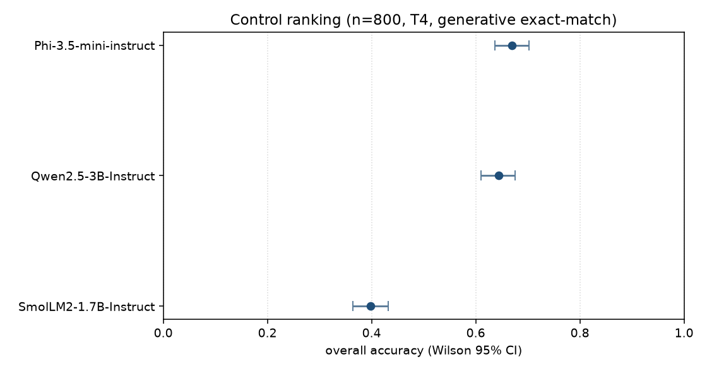
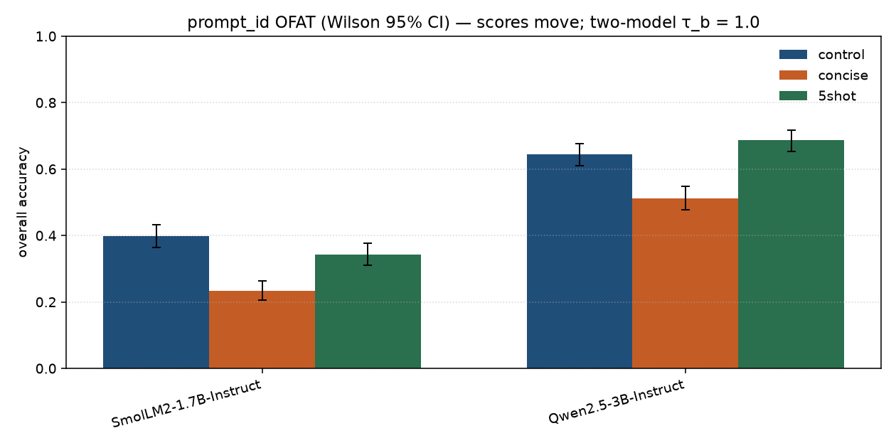
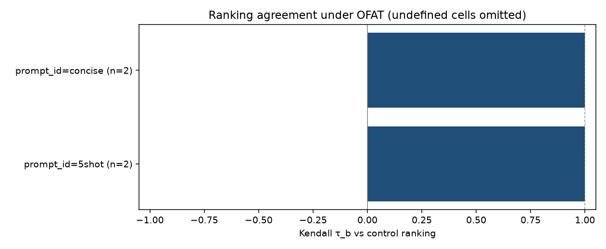

# apertus-eval-prep

**Evaluation configuration is part of the measurement.** Chat template, decoding backend, prompt, seed, and precision are named factors, not operator noise.

[](https://colab.research.google.com/github/Shivani767/apertus-eval-prep/blob/master/notebooks/colab_stability.ipynb)
[](https://colab.research.google.com/github/Shivani767/apertus-eval-prep/blob/master/notebooks/colab_vllm.ipynb)

Colab notebooks (already in this repo): [`notebooks/colab_stability.ipynb`](notebooks/colab_stability.ipynb) (T4 paper matrix — one factor cell per session) and [`notebooks/colab_vllm.ipynb`](notebooks/colab_vllm.ipynb) (HF vs vLLM canary).

Public frozen-prompt harness: same items, same extractor, Hugging Face `generate` vs vLLM on identical rendered strings, Wilson CIs and TTFT in one JSON. Probe for [swiss-ai evals-post-train](https://github.com/swiss-ai/evals-post-train) (HF vs vLLM on generation) and Apertus serving (`--chat-template-content-format string`). Not Alps. Not `swiss-ai/Apertus-v1.5-8B`.

---

## Abstract

A leaderboard score is a pair *(model, eval config)*. Two labs can disagree on the same weights if the chat template or the serving engine differs. This repo freezes that config in YAML + git, ablates **one factor at a time**, and refuses to mix tables across hardware.

**Hypothesis.** A working measurement pipeline must move when the template or backend changes, in a way a stranger can replay. Rank order is a second question: it needs intervals, not point estimates.

**One finding (n=800, committed JSON).** On the two-model `prompt_id` cohort (Qwen-3B + SmolLM2), Kendall $\tau_b = 1.0$ (0 reversals): relative order holds under `concise` and `5shot`. Scores still move — e.g. SmolLM2 default 318/800 → concise 186/800 (CIs disjoint); Qwen-3B default 515/800 → concise 410/800. McNemar rejects control equality on both models. Phi `prompt_id` is still missing for a three-model $\tau_b$.

Tables for Wilson / McNemar / $\tau_b$ are generated from the registry (`make paper`), not typed by hand.

---

## Results

Do not pool these tables. Device is a confound.

### A. Chat template — Mac MPS, n=28, `Qwen2.5-0.5B-Instruct`

Greedy decode. Only `chat_template` changes.

| condition | overall | ARC | GSM8K | multilingual | canary |
|---|---|---|---|---|---|
| tokenizer (correct) | **20/28 (71.4%)** | 8/8 | 2/8 | 7/8 | 3/4 |
| none | **15/28 (53.6%)** | 5/8 | 2/8 | 5/8 | 3/4 |
| Llama-3 wrap on Qwen | **12/28 (42.9%)** | 4/8 | 2/8 | 5/8 | 1/4 |

GSM8K is 2/8 in all three runs: capability floor on this probe, not a template effect. ARC and the format canary move. The Llama-3 wrap is the serving failure mode (engine default ≠ tokenizer template). [`notes/findings.md`](notes/findings.md)

### B. Backend — Colab T4, template fixed

Same rendered strings. vLLM is not given a second `llm.chat()` wrap.

| backend | overall |
|---|---|
| Hugging Face `generate` | **20/28 (71.4%)** |
| vLLM | **18/28 (64.3%)**, −7.1 pp |

The drop is multilingual (7/8 → 4/8), not ARC. One GSM8K item flipped; n=8, treat as noise. Claim is *not* “vLLM is worse at math.” Claim is: generative exact-match is backend-sensitive; hold the backend fixed when ranking models. [`results/compare_backend.md`](results/compare_backend.md)

### C. Sample size — Wilson 95% CI width

Prefix intervals on already-scored items. No extra GPU jobs. [`reports/ci_width/ci_width.md`](reports/ci_width/ci_width.md)

| run | n | acc | 95% Wilson CI | width |
|---|---:|---:|---|---:|
| T4 smoke | 4 | 0.25 | [0.046, 0.699] | **0.654** |
| Mac canary | 28 | 0.714 | [0.529, 0.848] | **0.318** |

A 25-point gap on n=4 is inside the interval. Point estimates are not ranks.

### D. Ranking matrix — official n=800, OFAT, in progress

Slices: ARC-Easy, GSM8K, HellaSwag, MGSM EN/DE/FR (200 each). Generative exact-match. Control: greedy, tokenizer template, HF generate. Protocol: [`paper/stability.md`](paper/stability.md)

| model | n | correct | acc | 95% Wilson CI |
|---|---:|---:|---:|---|
| SmolLM2-1.7B-Instruct | 800 | 318 | 0.398 | [0.364, 0.432] |
| Qwen2.5-3B-Instruct | 800 | 515 | 0.644 | [0.610, 0.676] |
| Phi-3.5-mini-instruct | 800 | 536 | 0.670 | [0.637, 0.702] |

SmolLM2 is separated from the other two. Phi and Qwen-3B **overlap** on this control (67.0% vs 64.4% is not a rank). Registry: [`results/registry_paper.jsonl`](results/registry_paper.jsonl) (8 of 34 T4 cells).

**D2. Qwen-7B int4 only (T4 skips 7B fp16).** Absolute score: **543/800 (0.679, [0.646, 0.710])**. Not comparable to the fp16 control table above. No same-model McNemar until a 7B control exists.

**D3. `prompt_id` — SmolLM2 + Qwen-3B (two-model cohort).** Kendall $\tau_b = 1.0$ (0 reversals) for `concise` and `5shot`. Order preserved. Scores still move (McNemar $p < 0.01$ on both models). Qwen concise **410/800**; Qwen 5shot **549/800**. Phi `prompt_id` still required for a three-model $\tau_b$.

| prompt | SmolLM2 | Qwen-3B |
|---|---:|---:|
| default (control) | 318 | 515 |
| concise | 186 | 410 |
| 5shot | 274 | 549 |

Figures from the same registry (`make figures`):







---

## Method

| Design | Implementation |
|---|---|
| Replay | Frozen JSONL + YAML; `git_commit` in every manifest |
| One cause | `compare` lists knobs that actually changed |
| No double template | vLLM scores already-rendered completion strings |
| Named incomparability | hardware, dtype, slice, sampling listed, not hidden ([`notes/incomparability.md`](notes/incomparability.md)) |
| Intervals | Wilson CI on every committed run; McNemar + Kendall $\tau_b$ implemented and unit-tested (`tests/test_stats.py`) |
| Serving | TTFT p95 in the same JSON as accuracy |
| Languages | MGSM EN/DE/FR (official); EN/DE/FR/IT/HI on the canary |

Control and OFAT factors (prompt, seed, backend, int8/int4) are in [`configs/experiments/stability.yaml`](configs/experiments/stability.yaml). T4 profile skips 7B fp16 / int8 / vLLM.

---

## Reproduce

```bash
git clone https://github.com/Shivani767/apertus-eval-prep
cd apertus-eval-prep
python3 -m venv .venv && source .venv/bin/activate
pip install -e ".[dev]"
pytest -q
python -m apertus_eval_prep eval --config configs/smoke.yaml --out results/smoke.json
```

`pytest` covers scoring, Wilson/McNemar/Kendall, OFAT + T4 skips, official-slice provenance, checkpoint resume, and the Phi load shim. Smoke then scores 4 items on `Qwen2.5-0.5B-Instruct`.

Regenerate the paper write-up from committed JSON (no hand-typed scores):

```bash
make paper
make figures
# paper: python -m apertus_eval_prep paper --registry results/registry_paper.jsonl --out-dir paper
# figures: python -m apertus_eval_prep report --registry results/registry_paper.jsonl --out reports/stability_paper
```

If `venv` fails on a PATH separator, the clone path contains `:`. Use `~/apertus-eval-prep`.

Template ablation (Mac; vLLM is Linux/CUDA):

```bash
python -m apertus_eval_prep eval --config configs/default.yaml --out results/hf_tokenizer.json
python -m apertus_eval_prep eval --config configs/no_template.yaml --out results/hf_none.json
python -m apertus_eval_prep eval --config configs/mismatched.yaml --out results/hf_mismatched.json
python -m apertus_eval_prep compare results/hf_tokenizer.json results/hf_none.json --out results/compare_template.md
```

vLLM ([`notebooks/colab_vllm.ipynb`](notebooks/colab_vllm.ipynb)):

```bash
pip install -e ".[gpu]"
python -m apertus_eval_prep eval --config configs/vllm.yaml --out results/vllm_tokenizer.json
python -m apertus_eval_prep compare results/hf_tokenizer.json results/vllm_tokenizer.json --out results/compare_backend.md
```

Ranking matrix: one 800-item cell per Colab session. Do not Run all. Persist to Drive `MyDrive/apertus-eval-prep-paper`. Do not write paper rows into `results/registry.jsonl` (n=4 smoke). Interrupted cells write `results/runs/{run_id}.partial.jsonl` after every item and mirror it to Drive; re-run the same sweep to resume. Notebook stdout is not a result.

```bash
python -m apertus_eval_prep sweep --config configs/experiments/stability.yaml \
  --profile t4 --out-dir results/runs --registry results/registry_paper.jsonl \
  --only-model HuggingFaceTB/SmolLM2-1.7B-Instruct --only-factor prompt_id
```

---

## Slices

| Task | canary n | official n | Role |
|---|---|---|---|
| ARC-Easy | 8 | 200 | English MCQ |
| GSM8K | 8 | 200 | Verifiable math; backend-sensitive under generation |
| HellaSwag | — | 200 | Generative letter (not loglikelihood) |
| MGSM | 10 (EN/DE/FR/IT/HI) | 200 (EN/DE/FR) | Multilingual exact-match. Italian was added after the committed n=28 canary JSON; Experiments 1–2 still score 8 multilingual items. |
| template_canary | 4 | — | Fails if the template is missing or wrong |

Canary: [`data/eval_set.jsonl`](data/eval_set.jsonl). Hub revisions: [`data/official/SOURCES.md`](data/official/SOURCES.md). Modes: `tokenizer` = `apply_chat_template`; `none` = raw user string; `mismatched` = Llama-3 tokens on a Qwen prompt.

---

## Honesty

- No Slurm, Megatron, NCCL, GH200, or Apertus-8B. Colab T4 / Mac is the cluster.
- Generative exact-match ≠ lm-eval loglikelihood ≠ a model-card headline.
- n=28 is a serving canary (Experiments 1–2). Committed n=800 rows are not yet a full OFAT ranking table.
- If it is not in git JSON, it did not happen. `make paper` only reprints `results/registry_paper.jsonl`. Missing cells stay TODO.
- A later canary language add does not rewrite the committed 28-item template/backend tables.

On a real partition the science does not change: pin a named model revision, keep this extractor and OFAT YAML, replace the notebook loop with array jobs over the same `config_hash` registry.

Cite: [`CITATION.cff`](CITATION.cff). Protocol: [`paper/stability.md`](paper/stability.md).

Not yet run (no scores): [`configs/apertus_probe.yaml`](configs/apertus_probe.yaml), [`configs/experiments/paraphrase.yaml`](configs/experiments/paraphrase.yaml), [`configs/azureml.yaml`](configs/azureml.yaml). Issue draft (not filed): [`notes/evals_post_train_issue.md`](notes/evals_post_train_issue.md).

## License

Apache-2.0. Item licenses: [`data/README.md`](data/README.md).
